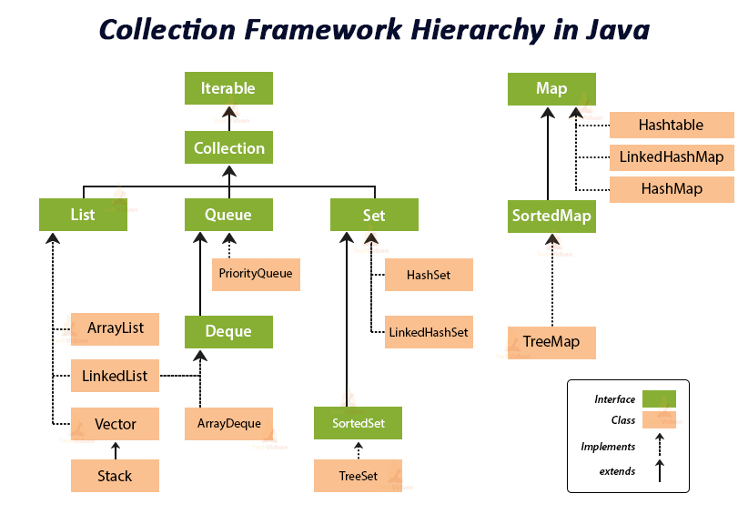

# Java의 Collection이란?

<figure><figcaption></figcaption></figure>

### Collection 이란?

자바에서 컬렉션이란 데이터의 집합, 그룹을 의미하며 자바 컬렉션 프레임워크(Java Collections Framework)는 객체들을 한 곳에 모아 관리하고, 편하게 사용하기 위해 제공되는 환경이다.

컬렉션과 이를 구현하는 클래스를 정의하는 인터페이스를 제공한다.

* Collection에는 List, Map, Set, Stack, Queue 등이 있다.
  * Collection 인터페이스는 크게 List, Set, Queue로 3가지 상위 인터페이스로 분류할 수 있다.
  * Map은 Collection 인터페이스를 상속받고 있지 않지만 Collection으로 분류된다.

### Collection 사용 이유

* 다수의 데이터를 다루는데 표준화 된 클래스들을 제공해주기 때문에 자료구조를 직접 구현하지 않고 편하게 사용 가능하기 때문에
* 배열과 다르게 사이즈를 미리 정하지 않아도 되므로, 상황에 맞게 동적으로 할당해 공간적인 효율성을 높여준다.

#### List

* 순서가 있는 데이터의 집합으로 **데이터 중복을 허용**한다.
* List 인터페이스를 직접 오버라이드를 통해 사용자가 정의하여 사용할 수 있다.
* 대표적으로 ArrayList와 LinkedList가 있다.
  * ArrayList : Java의 Vector를 개선한 배열로 구현된 List이다.
    * 사실상 배열과 같은 자료구조이기 때문에 연산 수행 시간이 배열과 같다.
    * 단방향 포인터 구조로 각 데이터에 대한 인덱스를 가지고 있어 조회 성능이 뛰어남
  * LinkedList : 다음 노드의 주소를 기억하고 있는 List로 배열에 비해 삽입과 삭제가 간단하다.
    * 검색의 경우 첫 번째 노드부터 탐색하기 때문에 속도가 느리다.
    * 스택, 큐, 양방향 큐 등을 만들기 위한 용도로 쓰인다.

#### Map

* Key - Value의 쌍으로 이루어진 데이터 타입으로 **데이터 순서를 보장하지 않으며**, 키의 중복을 허용하지 않으나 값의 중복은 허용한다.
* Key의 순서를 보장하기 위해서는 LinkedHashMap을 사용한다.
* 대표적으로 HashMap, TreeMap 등이 있다.
  * HashMap : 가장 일반적으로 사용하는 Map
    * 키 값에 해시 함수를 적용하여 나온 인덱스에 값을 저장하는데, **중복과 순서가 허용되지 않으며** null 값이 올 수 있다.
  * TreeMap : Red-Black Tree 자료구조를 이용한 Map이다.
    * 트리 구조이기에 어느 정도 순서를 보장한다.
    * 정렬된 순서대로 Key, Value를 저장하여 **검색이 빠르다.**
  * HashTable : HashMap 보다는 느리지만 동기화를 지원한다.&#x20;
    * HashMap과 다른 점은 키 값 혹은 Value 값에 null을 넣으면 컴파일 에러 발생

#### Set

* 순서를 유지하지 않는 데이터의 집합으로 데이터의 중복을 허용하지 않는다.
* Map의 Key-Value 구조에서 Key 대신 value가 들어가 value를 키로하는 자료구조이다.
* Map과 같이 Set도 순서를 보장하지 않으며 순서를 보장하기 위해서는 LinkedHashSet을 사용한다.
* 대표적인 구현체로 HashSet이 있다.
  * HashSet : 가장 빠른 임의 접근 속도이고, 순서를 예측할 수 없다.
  * TreeSet : Red-Black Tree 자료구조를 사용한 Set이다.
    * 정렬 방법을 지정할 수 있다.

#### Stack & Queue

* Stack : 직접 new 연산자로 객체를 생성하여 사용 가능
* Queue : LinkedList에 new 연산자로 객체를 생성함으로써 사용 가능

